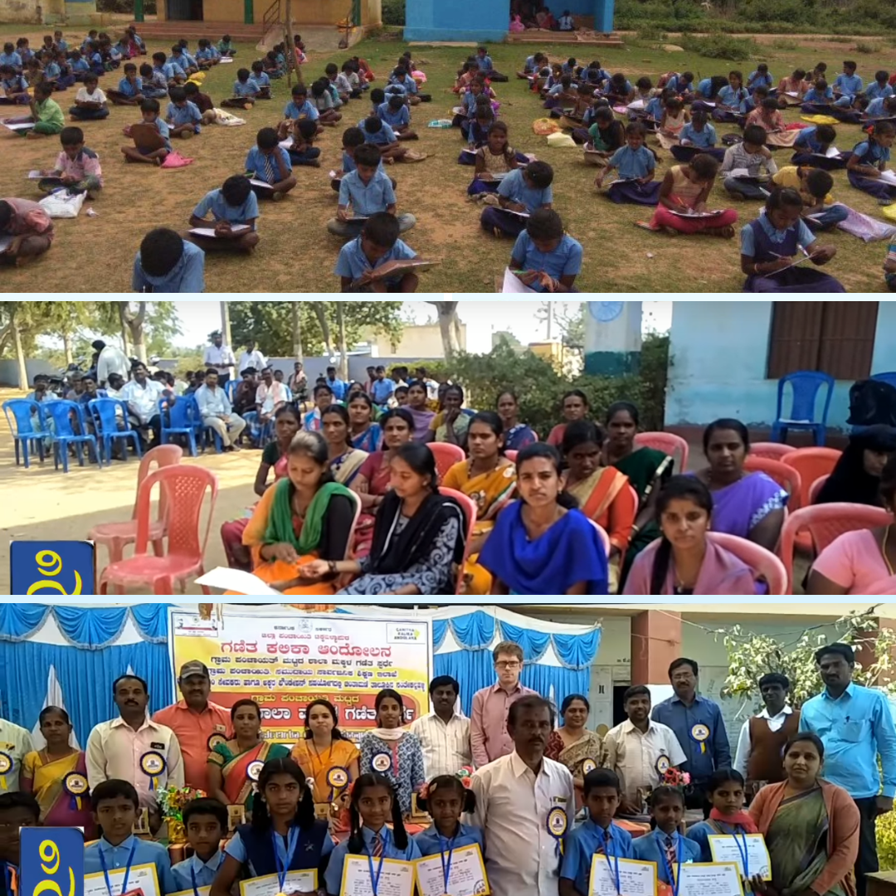
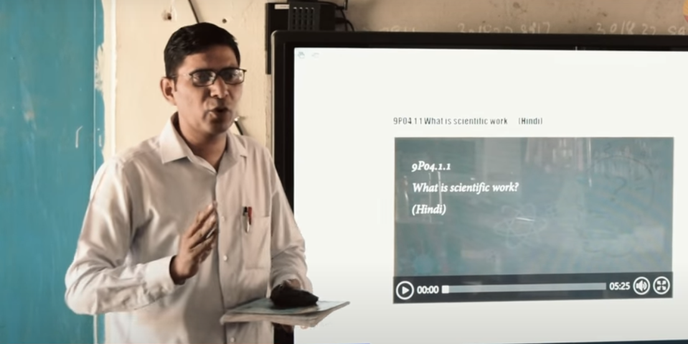
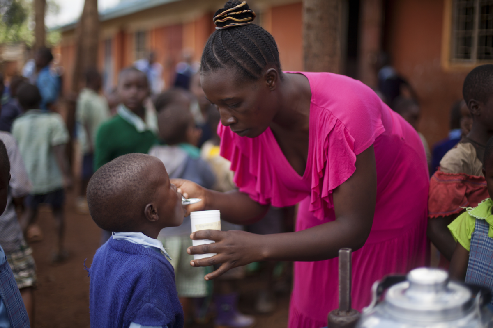
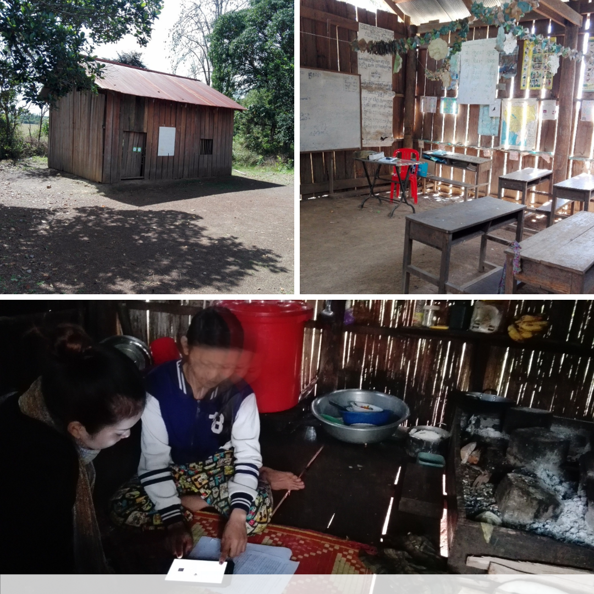
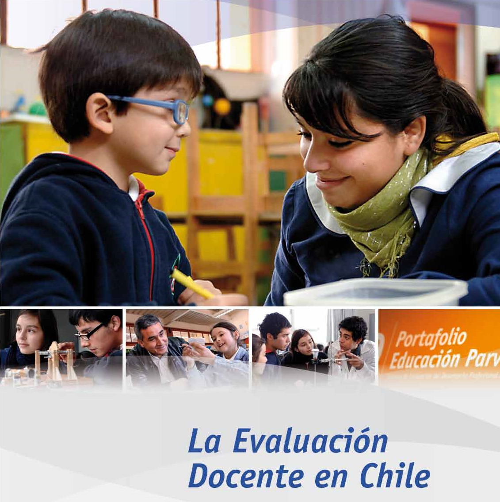
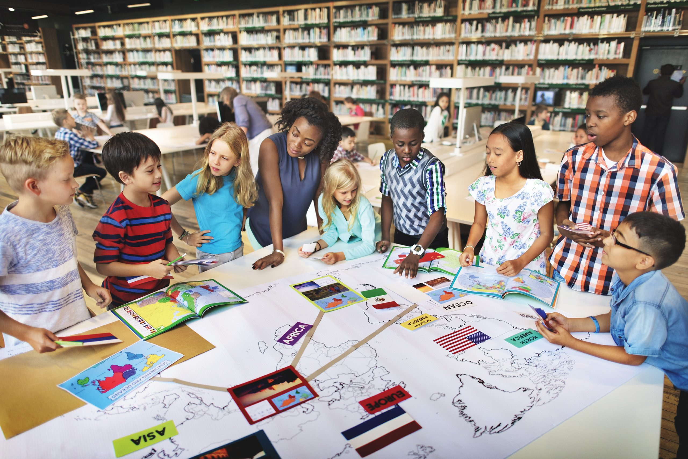
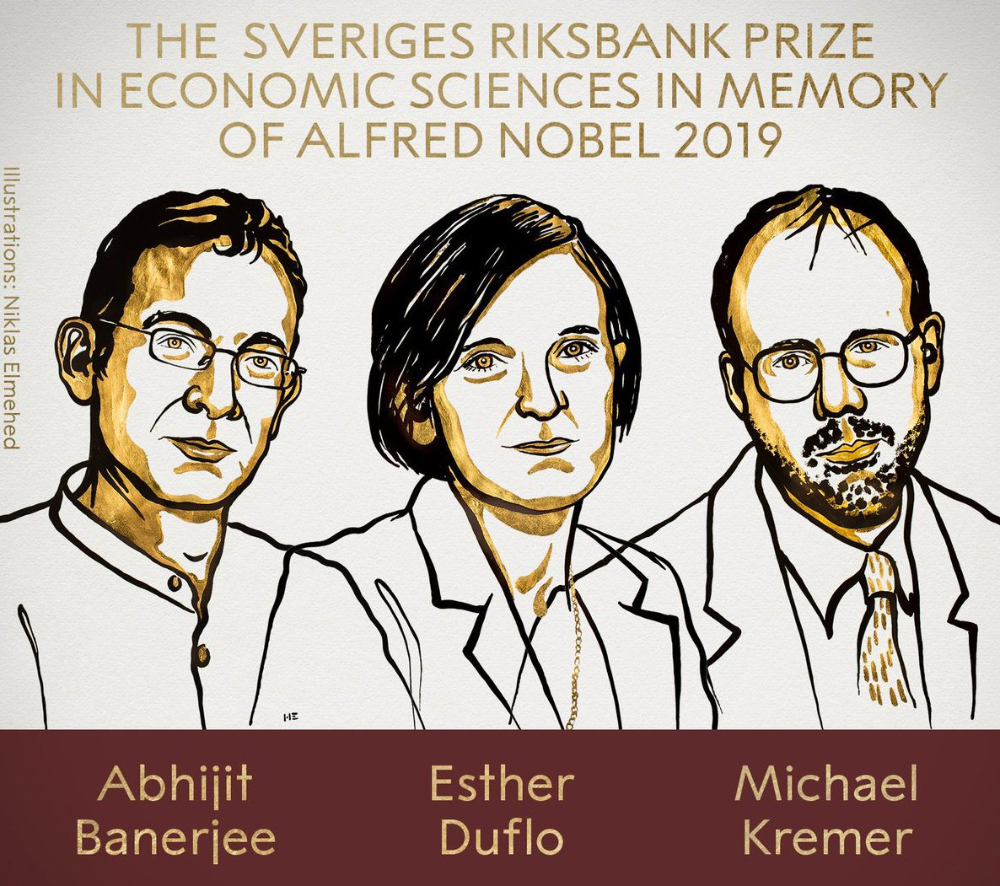
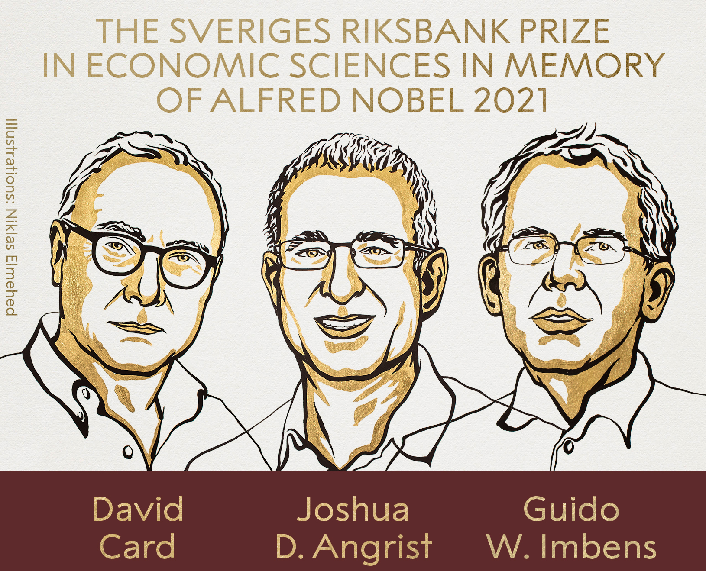
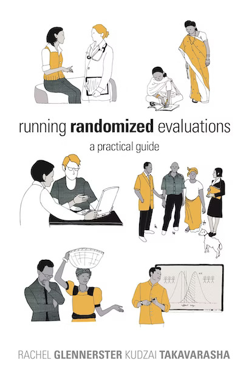
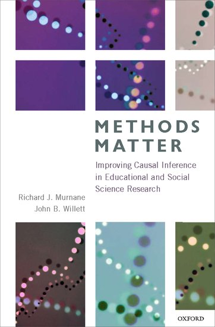

```{r setup, include=FALSE}
knitr::opts_chunk$set(warning = FALSE, message = FALSE, 
                      fig.retina = 3, fig.align = "center")
```

```{r packages-data, include=FALSE}
library(tidyverse)
library(ggdag)
```

```{r xaringanExtra, echo=FALSE}
xaringanExtra::use_xaringan_extra(c("tile_view"))
```

class: center middle main-title section-title-4

# Evaluation and the<br>causal revolution

.class-info[

**Class 1**

.light[EDUC 157: Educational Research and Evaluation<br>
UCI School of Education
]

]

---

name: outline
class: title title-8

# Plan for today

--

.box-1.medium.sp-after-half[Why evaluate?]

--

.box-3.medium.sp-after-half[Hello, it's me]

--

.box-6.medium.sp-after-half[Class details]

---

layout: false
name: why-evaluate
class: center middle section-title section-title-1 animated fadeIn

# Why evaluate?

---

layout: true
class: title title-1


---

# Community contests in Karnataka

.center[
<figure>
  
</figure>
]

???

Gram Panchayat (GP) Level Mathematics Contests are organised by the community for government school children in all GKA (Ganitha Kalika Andolana) districts of Karnataka. It’s a strategy to empower the community to take up quality to take up quality issues in the public school system within the framework of participatory democracy. Akshara Foundation acts as a facilitator to conduct these contests. The child’s numeracy levels data gathered through this contest is the most accurate and census level data available as the contests are conducted in the community with the presence of all stakeholders (Gram Panchayat members, parents, SDMC members, donors and the village community) in a transparent way

https://klp.org.in/gp-contest/

https://www.youtube.com/watch?v=ySyOsbWJGOI

---

# Blended instruction in Haryana

.center[
<figure>
  
</figure>
]

???

In the Avanti "Sankalp" program, government school teachers used video-based classroom resources to teach math and science in grades 9-12.

https://sankalp.avantifellows.org/

---

# Deworming in Kenya

.center[
<figure>
  
</figure>
]

???

Intestinal helminths—including hookworm, roundworm, whipworm, and schistosomiasis—infect more than one-quarter of the world’s population. Researchers evaluated a mass school-based deworming program in Western Kenya.

https://www.povertyactionlab.org/evaluation/primary-school-deworming-kenya

---

# Merit-based scholarships in Cambodia

.center[
<figure>
  
</figure>
]

???

We set out to discover whether scholarships could help third- and fourth-grade students in rural, impoverished areas of Cambodia attend and stay in primary school. More than that, we wanted to know which type of scholarship worked better — a merit scholarship, awarded based on academic achievement, or poverty scholarships, awarded according to highest financial need. Our research followed-up on these children 9 later, when they had reached young adulthood.

https://www.gse.harvard.edu/news/uk/19/02/scholarships-balance-equity-and-efficacy

https://blogs.worldbank.org/developmenttalk/power-label-merit-scholarships-vs-needs-based-scholarships

---

# Formative teacher evaluations in Chile

.center[
<figure>
  
</figure>
]

???

In Chile, every four years, all public-school teachers participate in the country's formative teacher evaluation system. The system has four components: Teachers submit a portfolio (which includes a video-recording of a class) and a self-evaluation. They are also evaluated by a peer and through their superiors (e.g., their principal). The system is mainly formative, and seeks to improve the quality of teaching in public schools. 

https://bibliotecadigital.mineduc.cl/handle/20.500.12365/17377

https://www.cpeip.cl/evaluacion-docente/

https://www.docentemas.cl/

https://es.wikipedia.org/wiki/Evaluaci%C3%B3n_Docente

---

# Class-size reductions in Tennessee

.center[
<figure>
  
</figure>
]

???

Aware of both the preliminary results of a CSR program in Indiana called Project Prime Time and the potential large scale costs of additional classrooms and teachers, in 1985, under then Governor Lamar Alexander, Tennessee began a three-phase project to determine the effects of reduced class sizes on short and long term pupil performance in the earliest grades.

The first phase, termed Project STAR (Student-Teacher Achievement Ratio), randomly assigned teachers and students to three groups, “small” (13 to 17), “regular” (22 to 25) classes with a paid aide, and “regular” (22 to 25) classes with no aide. In total some 6,500 students in about 330 classrooms at approximately 80 schools participated.

https://en.wikipedia.org/wiki/Class-size_reduction

---

# Doubling teacher pay in Indonesia

.center[
<figure>
  
</figure>
]

???

How does a large unconditional increase in salary affect the performance of incumbent employees in the public sector? A policy change in Indonesia led to a permanent doubling of teacher base salaries.

https://academic.oup.com/qje/article/133/2/993/4622956


---

# Evidence-based medicine

.center[
<figure>
  
</figure>
]

???

Polio shots administered blindly with placebo - kids didn't know, doctor didn't know (double blind) - effect found

Why not just use those who didn't get a shot as the control group? Why placebo? Kids who opted out were poor (which actually had a lower incidence rate), so you can't compare them with the rich (which had higher incidence rate)

All drugs get the safety and efficacy requirement and double blind RCTs after that

https://www.npr.org/sections/health-shots/2020/05/22/860789014/the-race-for-a-polio-vaccine-differed-from-the-quest-to-prevent-coronavirus

---

# Modern evidence-based medicine

.box-inv-1.medium[Apply evidence to clinical<br>treatment decisions]

--

.box-inv-1.medium.sp-after[Move away from clinical judgment<br>and "craft knowledge"]

--

.box-1.medium[Is this good?]

???

No, this isn’t the greatest. Push for evidence-based practice can crowd out clinical judgment, which is valuable – we can’t ignore it or dismiss it

---

# Evidence-based education policy

--

.box-inv-1.less-medium[To reduce poverty by ensuring that<br>policy is informed by scientific evidence]

--

.box-inv-1.less-medium[Focus on high-quality research to answer the question “what works in education?”]

--

.box-inv-1.less-medium[[The Department of Education] shall give grant priority to (...) evidence-based activities.]


???

- The first statement is from J-PAL's mission statement.
- The second statement is from the "About" page from the IES What Works Clearinghouse.
- The third statement is copied from the Every Student Succeeds Act (ESSA)

---

# Drivers of evidence-based policy

--

.box-inv-1.medium[Abdul Latif Jameel Poverty Action Lab (J-PAL)]

--

.box-inv-1.medium[Campbell Collaboration]

--

.box-inv-1.medium[IES What Works Clearinghouse]

--

.box-inv-1.medium[Every Student Succeeds Act]

???

- https://www.povertyactionlab.org/
- https://campbellcollaboration.org/
- https://ies.ed.gov/ncee/wwc/
- https://www.congress.gov/bill/114th-congress/senate-bill/1177

---

# Evidence and you

--

.box-inv-1.medium[Producer]

--

.box-inv-1.medium[Consumer]

--

.box-inv-1.medium[User]

---

layout: false

&nbsp;

.box-1.large[Should we have evidence for<br>every policy or program?]

--

.box-inv-1.medium[**No!**]

--

.box-inv-1[Science vs. art/craft/intuition]

--

.box-inv-1[Science vs. normative decisions/politics]

--

.box-inv-1[Research > program evaluation; not all evaluations are research]

---

&nbsp;

.box-1.large[Where does evaluation<br>fit with all this?]

--

.box-inv-1[It's a method for collecting evidence<br>for policies and programs]

---

class: title title-1

# Theory → impact

<figure>
  
</figure>

---

layout: true
class: title title-1

---

# Types of evaluation

.pull-left.center[
<figure>
  
</figure>
]

.pull-right[
.box-inv-1[Needs assessment]

.box-inv-1[Design and<br>theory assessment]

.box-inv-1[Process evaluation<br>and monitoring]

.box-inv-1[Impact evaluation]

.box-inv-1[Efficiency evaluation (CBA)]

]

---

# Types of impact evaluation

.pull-left.center[
<figure>
  
</figure>
]

.pull-right[
.box-inv-1[Prospective vs. retrospective]

.box-inv-1[Efficacy vs.<br>effectiveness studies]

.box-inv-1[Standalone program vs.<br>design innovations vs.<br>implementation focused]

.box-inv-1[Overall effects vs.<br>subgroup analyses]

]

---

class: title title-1

# Theory → impact

<figure>
  
</figure>

---

layout: false
class: bg-full
name: evidence-evaluation-causation1

.center[
<figure>
  
</figure>
]

???

https://en.wikipedia.org/wiki/Godwin%27s_law

---

class: title title-1

# Godwin's law for statistics

--

.box-inv-1.medium[Correlation does not<br>imply causation]

--

.box-1[Except when it does]

--

.box-1[Even if it doesn't,<br>this phrase is useless<br>and kills discussion]

---

.center[
<figure>
  
</figure>

<hr>

<figure>
  
</figure>
]

???

https://slate.com/technology/2012/10/correlation-does-not-imply-causation-how-the-internet-fell-in-love-with-a-stats-class-cliche.html

---

layout: true
class: title title-1

---

# Correlation vs. causation

.pull-left[
.box-inv-1.medium[How do we figure out correlation?]
]

.pull-right[
.box-inv-1.medium[How do we figure out causation?]
]

---

# Correlation vs. causation

.pull-left[
.box-inv-1.medium[How do we figure out correlation?]

.box-1[Math and statistics]
]

.pull-right[
.box-inv-1.medium[How do we figure out causation?]
]

---

# Correlation vs. causation

.pull-left[
.box-inv-1.medium[How do we figure out correlation?]

.box-1[Math and statistics]
]

.pull-right[
.box-inv-1.medium[How do we figure out causation?]

.box-1[Take this class!]
]

---

# The causal revolution

.pull-left-narrow[
<figure>
  
</figure>
]

.pull-right-wide.center[
<figure>
  
</figure>
]

---

# The causal revolution

.center[.image-container[
  .pull-left-wide[
    <figure>
      
    </figure>
  ]
  
  .pull-right-wide[
    <figure>
      
    </figure>
  ]
]]

<style>
.image-container {
  display: flex;
  align-items: flex-start; /* Align items to the top */
}
</style>

---

layout: false
class: bg-full
background-image: url("img/01/eval-flowchart.png")

---

layout: false
name: hello
class: center middle section-title section-title-3 animated fadeIn

# Hello, <br>it's me

---

layout: false
class: bg-full
background-image: url("img/01/hello1.png")

---

layout: false
class: bg-full
background-image: url("img/01/hello2.png")

---

layout: false
class: bg-full
background-image: url("img/01/hello3.png")

---

layout: false
class: bg-full
background-image: url("img/01/hello4.png")

---

layout: false
class: bg-full
background-image: url("img/01/hello5.png")

---

layout: false
name: class-details
class: center middle section-title section-title-6 animated fadeIn

# Class details

---

layout: true
class: title title-6

---

# Setting norms

--

.box-inv-6.medium[~~Laptops, tablets, phones~~]

--

.box-inv-6.medium[~~Food~~]

--

.box-inv-6.medium[Let's stay focused]

--

.box-inv-6.medium[Come prepared]

--

.box-6.medium[Let's help each other]


---

layout: false
class: bg-full
background-image: url("img/01/syllabus.jpg")

???
https://phdcomics.com/comics.php?f=1583

---

layout: true
class: title title-6

---

# Textbooks

.pull-left-3.center[
<figure>
  
</figure>
]

.pull-middle-3.center[
<figure>
  
</figure>
]

.pull-right-3.center[
<figure>
  
</figure>
]

---

layout: false

class: bg-full
background-image: url("img/01/geordi.png")

---

layout: true
class: title title-6

---

# Class technology

.center[
<figure>
  
</figure>

<figure>
  
</figure>
]

---

# Am I making you computer scientists?

--

.box-inv-6.huge[**No!**]

--

.box-6[You don't need to be a mechanic to drive a car safely]

--

.box-6[You don't need to be a computer scientist<br>or developer to use R safely]

???

Words of wisdom from @allison_horst: You don't need to be a mechanic to drive a car safely, and you don't need to be a computer scientist or developer to use R safely. #rstats #tidytuesday

https://twitter.com/ameliaritger/status/1214682596182904832?s=12

There’s three levels of skill: driver, mechanic, engineer. You’re here to get your drivers license. But being able to change a tire can be helpful. Don’t worry not every one has to be an engineer. (I talk about R in social sciences)

https://twitter.com/Sumidu/status/1214695065387438083

---

layout: false
class: center middle

.box-6.huge[You can do this.]

---

layout: true
class: title title-6

---

# Goals for the class

--

.box-inv-6.medium[~~Become an expert with R~~]

--

.box-inv-6.medium[~~Become a statistician~~]

--

.box-inv-6.medium[Speak and do causation]

--

.box-inv-6.medium[Design rigorous evaluations]

--

.box-6.medium[Change the world with data]

---

# Prerequisites

--

.box-inv-6.medium[**Math skills**]

.box-inv-6.small.sp-after[Basic algebra]

--

.box-inv-6.medium[**Computer science skills**]

.box-inv-6.small.sp-after[None]

--

.box-inv-6.medium[**Statistical skills**]

.box-inv-6.small[Regression, differences in means, and statistical significance]

---

layout: true
class: title title-6

---

# Work products

--

.box-inv-6.medium[Participation, reading reactions]

--

.box-inv-6.medium[Data-analytic memos (DAMs)]

--

.box-inv-6.medium[Exam]

--

.box-inv-6.medium[Milestones 1-3]

--

.box-6.medium[Your evaluation plan]


???

Participation, reading reactions	14%
Data-analytic memos (DAMs)	30%
Exam	25%
Milestones 1-3	2% each
Your evaluation plan	25%

---

name: outline
class: title title-8

# Plan for next class

--

.box-8.medium[**Survey**]

.box-inv-8.small.sp-after[Link from me]

--

.box-8.medium[**Reading reactions**]

.box-inv-8.small.sp-after[Submit on Canvas, ask for help on Slack]

--

.box-8.medium[**Choose a program to evaluate**]

.box-inv-8.small[Meet with your team]
