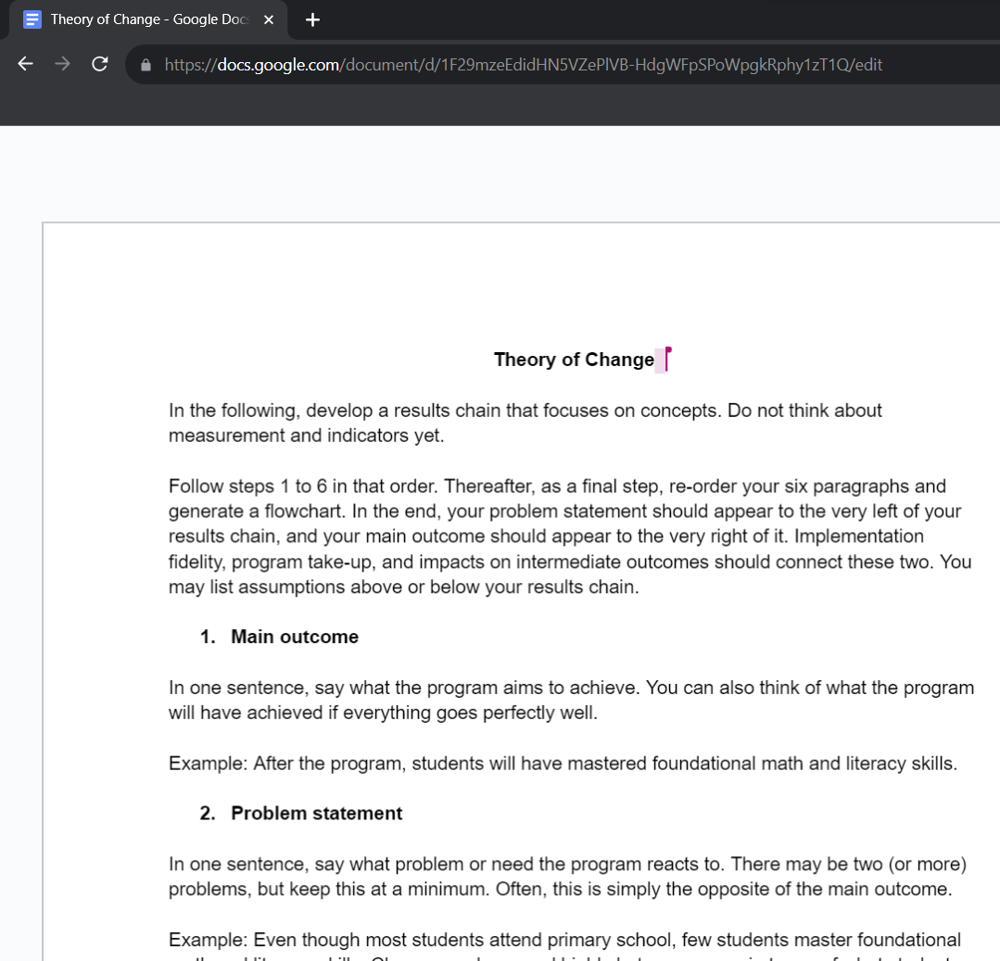

```{r setup, include=FALSE}
knitr::opts_chunk$set(warning = FALSE, message = FALSE, 
                      fig.retina = 3, fig.align = "center")
```

```{r packages-data, include=FALSE}
#
```

```{r xaringanExtra, echo=FALSE}
xaringanExtra::use_xaringan_extra(c("tile_view"))
```

class: center middle main-title section-title-4

# Theory<br>of change

.class-info[

**Class 2**

.light[EDUC 157: Educational Research and Evaluation<br>
UCI School of Education
]

]


---

layout: false
class: bg-full
background-image: url("img/01/eval-flowchart.png")

---

name: outline
class: title title-4

# Plan for today

--

.box-1.medium.sp-after-half[Program theories]

--

.box-3.medium.sp-after-half[A case study from Zambia]

--

.box-6.medium[Your program's Theory of Change]

---

layout: false
name: program-theories
class: center middle section-title section-title-1 animated fadeIn

# Program theories

---

layout: true
class: title title-1

---

# Elements of a program

.pull-left[
.box-inv-1[Inputs]

.box-1.smaller.sp-after[Things that go into an activity; money, people, time, etc.]

.box-inv-1[Activities]

.box-1.smaller.sp-after[Actions that convert inputs to outputs; things that the program does]
]

--

.pull-right[
.box-inv-1[Outputs]

.box-1.smaller.sp-after[Tangible goods and services produced by activities; you have control over these]

.box-inv-1[Outcomes]

.box-1.smaller.sp-after[What happens when the target population uses the outputs; you don't have control over these]
]

--

.center[<br>**Inputs → Activities → Outputs → Outcomes**]


---

# Program theory

.box-inv-1.medium[How and why an<br>intervention causes change]

--

.box-1[A sequence of events that connects inputs to<br>activities to outputs to outcomes]

--

.box-1[Why you think inputs → activities → outputs → outcomes]

---

# One Laptop Per Child (OLPC)

.center[
<figure>
  
</figure>
]

???

Nicholas Negroponte from MIT, started the Media Lab there

Draw impact theory: access to computers → 21st century skills, access to global marketplace, reduction of poverty, growth of local businesses

https://www.theverge.com/2018/4/16/17233946/olpcs-100-laptop-education-where-is-it-now

https://en.wikipedia.org/wiki/OLPC_XO#/media/File:XO-Beta1-mikemcgregor-2.jpg

---

# OLPC

&nbsp;

.pull-left-narrow[
<iframe width="560" height="315" src="https://www.youtube.com/embed/H4F_0sshG28?start=704" frameborder="0" allow="accelerometer; autoplay; encrypted-media; gyroscope; picture-in-picture" allowfullscreen></iframe>
]

--

.pull-right-wide[
<figure>
  
  <figcaption><small>Adi Robertson, <a href="https://www.theverge.com/2018/4/16/17233946/olpcs-100-laptop-education-where-is-it-now">"OLPC's $100 laptop was going to change the world—then it all went wrong"</a></small></figcaption>
</figure>
]

???

Everything fell apart though. It wasn’t ready—it had unrealistic expectations and was too utopian. It also didn’t take local conditions into account

https://www.youtube.com/watch?v=H4F_0sshG28

---

# Why theorize?

.pull-left[
.box-1[Implicit theory]

.box-inv-1.small[What program designers think or assume is going to happen, and why]

.box-inv-1[Assumed]
]

--

.pull-right[
.box-1[Articulated theory]

.box-inv-1.small[What program designers officially claim and predict, and why]

.box-inv-1.sp-after[Written down]

]

--

.box-inv-1.medium[Should all social programs be<br>rooted in explicit articulated theory?]


???

What difference does articulation make?

---
layout: false
class: bg-full
background-image: url("img/03/wb-results-chain.png")

???

p. 39 in *Impact Evaluation in Practice*, The World Bank

---

layout: true
class: title title-1

---

# Impact theory vs. logic model

.pull-left[
&nbsp;

<figure>
  
</figure>
]

.pull-right[
<figure>
  
</figure>
]

---

layout: false
name: logic-models
class: center middle section-title section-title-3 animated fadeIn

# A case study<br>from Zambia

---

layout: true
class: title title-3

---

# Catch Up / Teaching at the Right Level

&nbsp;

.pull-middle-3[
<iframe width="660" height="315" src="https://www.youtube.com/embed/1N9A-KJbKJg?start=1" frameborder="0" allow="accelerometer; autoplay; encrypted-media; gyroscope; picture-in-picture" allowfullscreen></iframe>
]

.pull-right[

.box-inv-1[https://bit.ly/resultschain]

]

---

layout: false
name: logic-models
class: center middle section-title section-title-6 animated fadeIn

# Your program's<br>Theory of Change

---

.box-6.less-medium[Final outcome]

.box-6.smaller[Problem statement]

--

.box-6.less-medium[Intermediate outcomes]

--

.box-6.less-medium[Outputs]

.box-6.smaller[Program take-up]

.box-6.smaller[Implementation fidelity]

--

.box-6.less-medium[Inputs and activities]

--

.box-6.less-medium[Assumptions]

---

.box-6.less-medium[1 Final outcome]

.box-6.smaller[2 Problem statement]

.box-6.less-medium[5 Intermediate outcomes]

.box-6.less-medium[Outputs]

.box-6.smaller[3 Program take-up]

.box-6.smaller[4 Implementation fidelity]

.box-6.less-medium[4 Inputs and activities]

.box-6.less-medium[6 Assumptions]

---


.pull-left.center[
<figure>
  
</figure>
]

.pull-right[

.box-inv-1[https://bit.ly/ToC-gdoc]

]

---

name: outline
class: title title-8

# Plan for next class

--

.box-8.medium[**Reading reactions**]

.box-inv-8.small.sp-after[Submit on Canvas, ask for help on Slack]

--

.box-8.medium[**Keep working on Milestone 1**]

.box-inv-8.small[Meet with your team]

.box-inv-8.small[Review assignment on course website]

.box-inv-8.small[Due at the end of the week]
